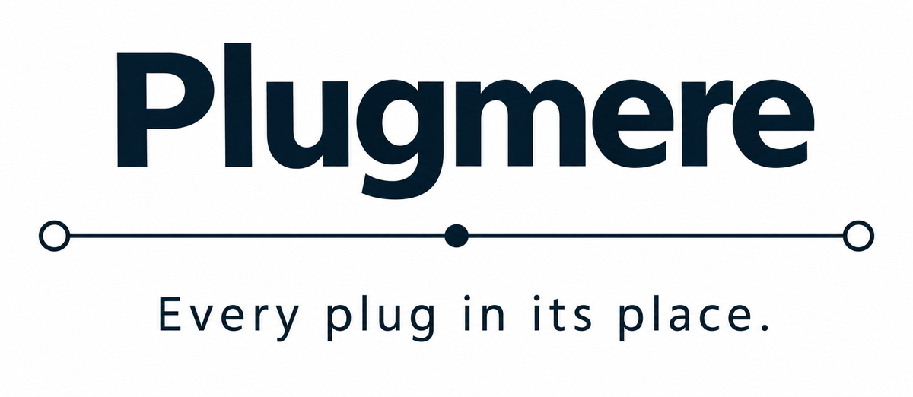
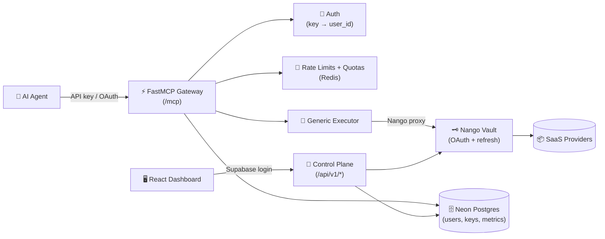

<p align="center">
  <a href="https://plugmere-dashboard.vercel.app/" target="_blank">
    
  </a>
</p>

<p align="center">
  <a href="https://plugmere-dashboard.vercel.app/" target="_blank">
    
  </a>
  <a href="https://plugmere-status.vercel.app/" target="_blank">
    
  </a>
</p>

<p align="center">
  <a href="#features">Features</a> ·
  <a href="#architecture">Architecture</a> ·
  <a href="#connect-your-agent">Connect</a> ·
  <a href="#quick-start">Quick Start</a> ·
  <a href="#project-structure">Structure</a>
</p>

<p align="center">
  
  
  
  
  
  
  
  
  
  
</p>

---

One endpoint that plugs your SaaS stack into any LLM agent — every tool behind API-key or OAuth auth, with per-user connections, quotas, and metering.

## Features

- **Every Tool, One Endpoint** — Gmail, Slack, Drive, Calendar, YouTube, Docs, Maps, Tavily, Brevo, SerpAPI and more, all behind `https://plugmere-api.onrender.com/mcp`
- **Per-User Connections** — users only see tools for providers they've connected (`list_my_tools` filters to connected providers only)
- **Dual Auth** — API keys for desktop/CLI clients, full OAuth (DCR + PKCE) for ChatGPT and Claude.ai connectors
- **Abuse Protection** — per-key rate limits, per-user daily quotas (5,000/day), per-provider caps, circuit breaker, connection caps
- **Billing-Ready Metering** — every call logged to `tool_calls` + `metric_daily` rollups; limits become plan entitlements later
- **Dynamic OpenAPI Adapter** — import any OpenAPI spec, `securitySchemes` parsed per-tool, auth applied at runtime (bearer/header/query/oauth2)
- **Abuse Monitoring** — 15-min cron watches error spikes, provider outages, DCR spam, quota burn; Brevo email alerts
- **Status Page** — 90-day uptime sticks, per-component health, incident timeline, subscribe for alerts

## Architecture



| Component | Stack |
|---|---|
| **Gateway** | FastMCP 4.x (`gateway/`, `plugmere/server.py` — mounted, one port) |
| **Control Plane** | FastAPI (`control-plane/app/`, users/keys/tools/connections/metrics/alerts routers) |
| **Dashboard** | React + Vite + Tailwind + shadcn/ui (`web/`) |
| **Status Page** | React + Vite (`status/`, 90-day probes via cron) |
| **OAuth Vault** | Nango self-hosted (Docker, Render image deploy) |
| **Database** | Neon Postgres (users, api_keys, tool_calls, metric_daily, tool_registry, oauth_*) |
| **Cache/Limits** | Upstash Redis (rate limits, key cache, response cache) |
| **Auth (humans)** | Supabase Auth (Google login, admin roles) |
| **Auth (machines)** | API keys (SHA-256) + OAuth JWT (DCR + PKCE) |

## Connect Your Agent

Point any MCP client at the gateway with your API key (create one in the dashboard):

```jsonc
// opencode — opencode.json
{ "mcp": { "plugmere": { "type": "remote",
  "url": "https://plugmere-api.onrender.com/mcp",
  "enabled": true,
  "headers": { "Authorization": "Bearer sk-xxxx" } } } }
```

```json
// Claude Desktop
{ "mcpServers": { "plugmere": {
  "url": "https://plugmere-api.onrender.com/mcp",
  "transport": "http",
  "headers": { "Authorization": "Bearer sk-xxxx" } } } }
```

```bash
# Claude Code CLI
claude mcp add --transport http plugmere https://plugmere-api.onrender.com/mcp \
  --header "Authorization: Bearer sk-xxxx"
```

ChatGPT and Claude.ai custom connectors use OAuth — add the connector, log in with Google, approve consent. No keys to copy.

## Quick Start

```bash
git clone https://github.com/plugmere/plugmere.git
cd plugmere
pip install -r requirements.txt
```

Copy `.env.example` to `.env` and fill in your keys:

```env
DATABASE_URL="postgresql://..."
REDIS_URL="rediss://..."
NANGO_HOST="https://..."
NANGO_SECRET="..."
OAUTH_JWT_SECRET="..."
SUPABASE_URL="https://..."
SUPABASE_JWT_SECRET="..."
```

```bash
python plugmere/server.py
```

Open `http://localhost:8000/api/v1/health` — gateway lives at `/mcp`, control plane at `/api/v1/*`, auto-generated OpenAPI docs at `/openapi.json`.

## Project Structure

```
plugmere/
├── README.md                      # Project documentation
├── assets/
│   └── banner.png                 # README banner (1899×828)
├── plugmere/
│   └── server.py                  # Merged ASGI app — FastAPI outer + mounted FastMCP
├── gateway/
│   ├── server.py                  # FastMCP gateway (call_tool, list_my_tools, reload_registry)
│   ├── auth.py                    # Dual auth (API key + OAuth JWT)
│   ├── registry.py                # ToolDef model, load from DB
│   ├── executor.py                # Dynamic auth routing (apiKey/http/oauth2)
│   ├── abuse.py                   # Rate limits, quotas, circuit breaker
│   ├── nango.py                   # Nango proxy client
│   ├── db.py                      # Schema (14 tables)
│   └── config.py                  # Env config
├── control-plane/app/
│   ├── main.py                    # FastAPI app
│   └── routers/                   # auth, users, api_keys, tools, connections, metrics, alerts, oauth
├── web/                           # React dashboard (Vite + Tailwind + shadcn/ui)
├── status/                        # Status page (Vite + React)
├── infra/nango/
│   └── docker-compose.yaml        # Nango self-hosted (db, redis, server)
├── tests/                         # pytest (86 tests)
├── .github/workflows/
│   ├── ci.yml                     # ruff + pytest
│   └── alerts.yml                 # Abuse monitor cron (15 min)
├── AGENTS.md                      # Full project doc (arch, phases, runbook)
└── CONV.md                        # Conversation/decision log
```

## License

Apache-2.0 © [kairav7220](https://github.com/kairav7220)

---

<p align="center">
  Built with <a href="https://gofastmcp.com">FastMCP</a> ·
  <a href="https://fastapi.tiangolo.com">FastAPI</a> ·
  <a href="https://react.dev">React</a> ·
  <a href="https://neon.tech">Neon</a> ·
  <a href="https://upstash.com">Upstash</a> ·
  <a href="https://www.nango.dev">Nango</a> ·
  <a href="https://supabase.com">Supabase</a>
</p>

